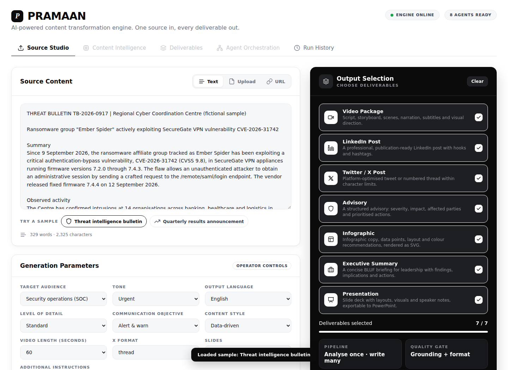
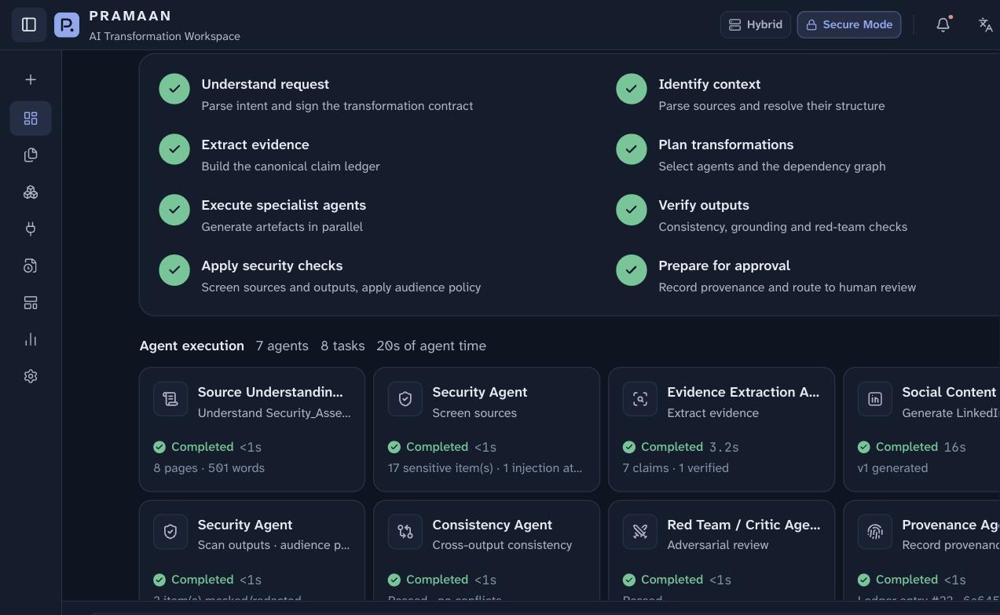
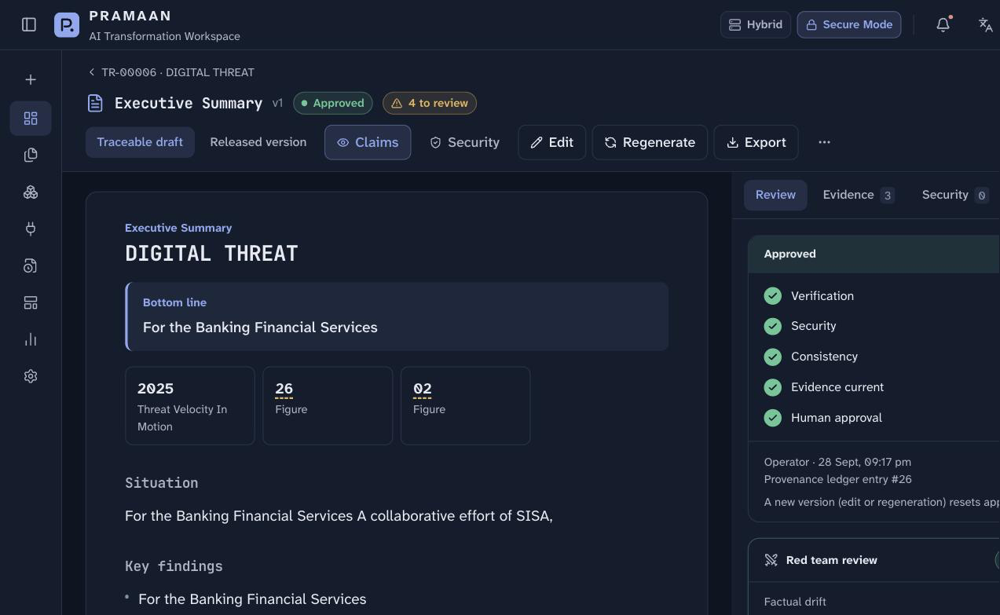
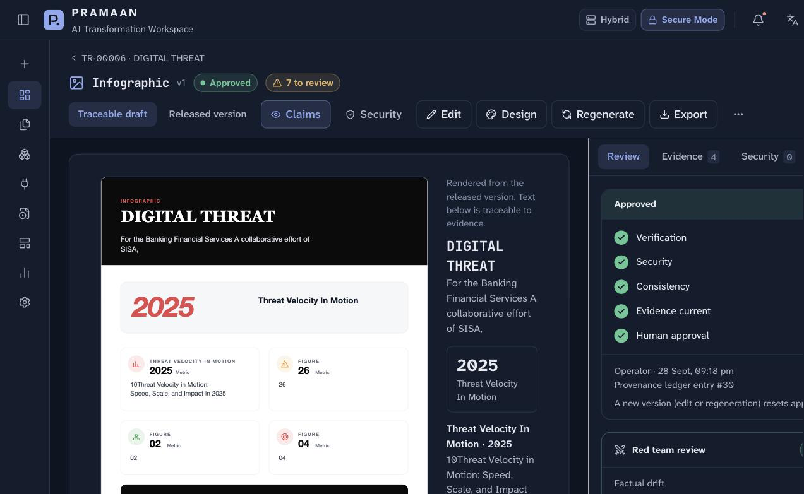
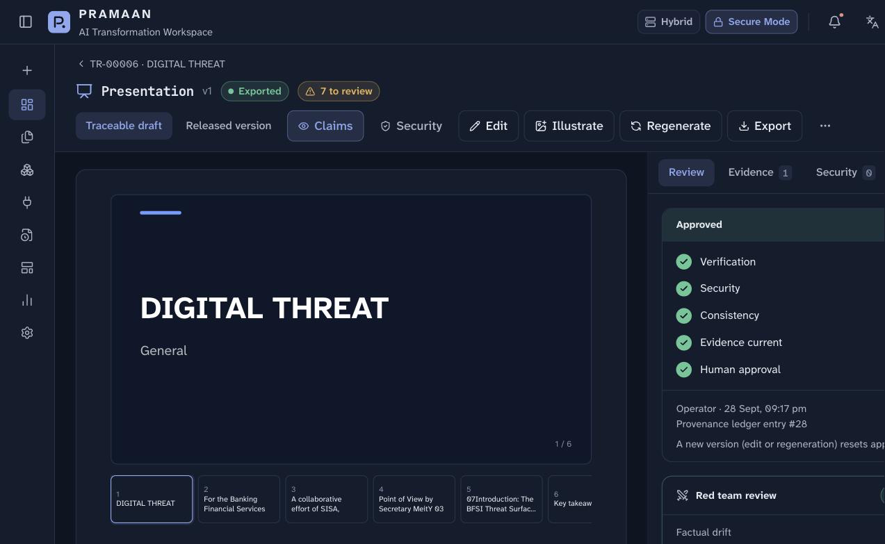
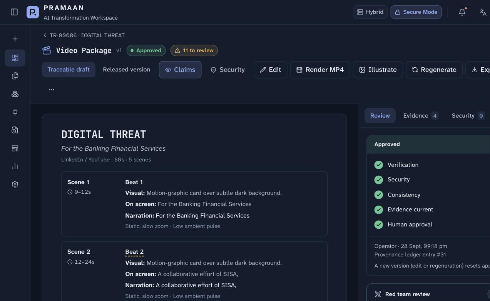
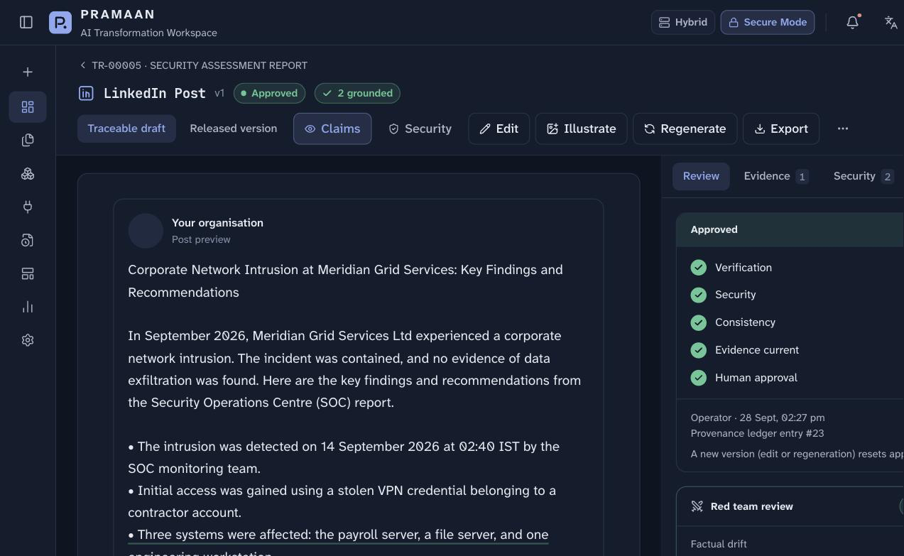

# PRAMAAN

**The AI transformation workspace that never lets a fact drift.**

PRAMAAN turns one source document into every artefact an organisation needs — executive summaries, advisories, infographics, presentations, LinkedIn posts, narrated video — without losing the thread back to the truth. Every sentence in every output is linked to a claim, every claim to a verbatim quote, page and bounding box in the source, and nothing ships until a person approves the exact version.

It is not a chatbot wrapper. It is a pipeline: **ingest → evidence → generate → verify → secure → approve → export**, with a hash-chained provenance ledger at every step.



## Why PRAMAAN

- **Traceable, not just fluent.** Click any underlined sentence in a generated artefact to see *why the AI said it* — the source claim, the exact page, and the highlighted evidence box.
- **Cross-output consistency.** Change a number in one artefact and the Consistency Agent flags every other artefact that now disagrees with it — and only regenerates the ones that actually depend on it.
- **Security by construction, not by prompting.** A dedicated detection layer finds PII, credentials, classification markings and prompt-injection attempts in the source, then applies an audience-aware policy (ALLOW / MASK / REDACT / RESTRICT / REVIEW / BLOCK) before anything is generated or exported.
- **Nothing exports without a human.** Export is enforced server-side — a 403 until the current version is explicitly approved. Stale, blocked or failing artefacts can't be approved.
- **Provenance you can audit.** Every generation, edit, security decision and approval is written to an append-only hash chain, independent of the audit log.
- **Fails loud, not silent.** If live model calls aren't available, PRAMAAN falls back to a deterministic extractive engine and says so — on the task, the artefact, and a workspace banner. No output is ever presented as AI-generated when it isn't.

## What it produces

One source, transformed in parallel by specialised agents into:

| Artefact | Agent |
|---|---|
| Executive summary, briefing, advisory | Content Intelligence Agent |
| Slide presentation (PPTX) | Presentation Agent |
| Infographic (SVG, and AI-designed image with read-back verification) | Design Agent |
| LinkedIn post with illustration | Social Agent |
| Narrated, subtitled video (MP4) | Video Production Agent |

Each is generated in the requested audience, tone, language, length and intent — and each carries the same evidence links back to the source.

<table>
<tr><td></td><td></td></tr>
<tr><td></td><td></td></tr>
<tr><td></td><td></td></tr>
</table>

## Quick start

Requirements: Python 3.10+, Node.js 20+.

```bash
cp .env.example .env        # add GROQ_API_KEY (free), or HF_TOKEN / MODEL_GATEWAY_URL
./run.sh                    # venv + pip + web build, serves http://127.0.0.1:8000
```

Development (hot reload): `uvicorn app.main:app --reload --port 8000` and `cd web && npm run dev` (Vite on :5173 proxies `/api`).

## Product tour

1. **Dashboard** → open the sample source `Security_Assessment_Report.pdf` (fictional, 8 pages).
2. Keep *Senior Officials · Formal · English · Medium · Inform · Mixed*, describe what you want (e.g. "Generate an executive summary, advisory, infographic and presentation") → **Transform**.
3. Watch the orchestrator plan the run and the agents work in parallel on the live task panel.
4. Open **Executive Summary** → click an underlined sentence → *Why did the AI say this?* — claim, source, **page 7 with the evidence box highlighted**, and the checks that passed.
5. `⋯` → **Inject test conflict (demo)** on the Presentation → the Consistency Agent raises **CLAIM CONFLICT DETECTED** → **Regenerate dependents** fixes only what's affected.
6. **Security** tab → see PII, a credential, internal infrastructure references, classification markings, and a **prompt injection** on page 8 caught and stripped from model context before generation.
7. Approve an artefact → **Provenance** tab / **Audit Logs** → inspect the hash-chained ledger entries for that run.
8. Optional: add `Field_Office_Incident_Note.txt` as a second source → PRAMAAN surfaces **SOURCE CONFLICT · UNRESOLVED** (14 vs 15 September) and holds it there until a human decides.

## How it works

| Layer | Implementation |
|---|---|
| Generation | Live LLM calls (OpenAI, GroqCloud, Hugging Face Inference Providers, or a self-hosted OpenAI-compatible gateway), tried in order. On failure the run falls back to a deterministic offline extractive engine and labels the output as such. |
| Evidence state | The model proposes facts and quotes; `app/evidence.py` earns each claim's status by locating the quote in the source, mapping it to a real PDF page and pdfium bounding box, reading its certainty from the source sentence, and merging or flagging conflicts across sources. |
| Verification | `app/verify.py` links every output sentence to a claim and deterministically checks for date/number drift, unsupported figures, uncertainty strengthening, and conflicts between artefacts. |
| Security | `app/security.py` runs detectors plus an audience/classification policy (ALLOW / MASK / REDACT / RESTRICT / REVIEW / BLOCK). Exported versions are exactly what this policy releases; injected instructions and credentials never reach the model. |
| Approval | Enforced server-side — export returns 403 until the current version is approved; stale, blocked or failing artefacts cannot be approved. |
| Provenance | `app/ledger.py` — an append-only hash chain (hashes and metadata only, never content) plus a separate audit log. No external blockchain anchoring is configured. |
| Dependency-aware regeneration | Correcting a claim marks only the artefacts that state it; only those are regenerated. |
| Transform-Bench | Quality metrics computed from local runs, labelled "Demo evaluation"; shown as "Not evaluated" when there's no data to compute from. |

## Configuration

| Variable | Purpose |
|---|---|
| `OPENAI_API_KEY` | **Preferred when set (billed per use).** Text agents run on `gpt-5.4-mini` (then `gpt-4.1-mini`, then Groq if configured), with native vision for images/scanned PDFs and `gpt-4o-transcribe` for speech. Illustrations use `gpt-image-1-mini`; narration uses multilingual `gpt-4o-mini-tts`, so English videos render locally with no watermark. **Designed infographics**: `gpt-image-2` draws only the released infographic text, then a vision model reads the image back and checks every line and figure against the verified content; a mismatch triggers one re-render, and export stays blocked until read-back passes. |
| `GROQ_API_KEY` | **Free fallback.** GroqCloud key: text agents run on `openai/gpt-oss-120b` (overflow to `gpt-oss-20b`), speech on Whisper. Free tier ≈1,000 requests/day and 8k tokens/min per model; the engine honours retry-after and overflows between models. |
| `CLOUDFLARE_ACCOUNT_ID`, `CLOUDFLARE_API_TOKEN` | Enables the **Visual Agent**: illustrations for LinkedIn, Presentation and Video artefacts via Workers AI FLUX.1 [schnell]. An art-director step turns each slide topic into a wordless photographic scene; prompts are scrubbed of sensitive data and figures; images are labelled, hashed into the ledger and embedded in PPTX exports. |
| `JSON2VIDEO_API_KEY` | Preferred video renderer. JSON2Video renders the verified script in the cloud with its own AI images (flux-schnell), Azure neural narration in the contract language (Hindi, Tamil, Telugu and more), and word-highlighted subtitles; the MP4 is downloaded, hashed and gated like any artefact. Checks quota and the plan's length cap first (narration is never cut) and otherwise renders locally. JSON2Video has no text-to-video model; motion comes from Nova Reel below. |
| `POLLINATIONS_API_KEY` | Optional. **Video Production Agent** renders the Video Package to one MP4: Aura-2 narration of the verified, released script (Cloudflare), burned-in subtitles, an "AI-generated video" mark, and per-scene visuals. With this key each scene is a real Nova Reel motion clip; without it, or if a clip fails, the scene is an animated FLUX still. Rendering is refused while any narration line fails verification; MP4 export requires approval. |
| `HF_TOKEN` | Hugging Face token with *Make calls to Inference Providers*. Free accounts have a small monthly credit; HTTP 402 means it is used up. |
| `HF_TEXT_MODEL` | Comma-separated text models, tried in order. |
| `HF_VISION_MODEL`, `HF_ASR_MODEL` | Perception for images/scans/video and speech. |
| `MODEL_GATEWAY_URL` | Self-hosted OpenAI-compatible endpoint (vLLM/TGI/LiteLLM) → deployment shows **On-Prem**. |
| `PRAMAAN_MAX_UPLOAD_MB`, `PRAMAAN_MAX_PARALLEL` | Limits. |

Secrets live only in `.env` (git-ignored) on the server; nothing is sent to the browser.

## Deploy

PRAMAAN runs agents in the background and keeps live state in memory, so it needs a **long-running container with one replica** and a persistent volume. Railway or Render work; serverless platforms (e.g. Vercel functions) do not.

```bash
railway login
railway init -n pramaan
railway up --detach                                   # builds the Dockerfile
railway volume add --mount-path /data                 # evidence, audit log, ledger
railway variables --set HF_TOKEN=... --set PRAMAAN_ACCESS_PASSWORD=...
railway domain                                        # public URL
```

Render: `render.yaml` is a ready Blueprint (Docker, 1 instance). It defaults to the **free** plan: no persistent disk (data resets on restart) and the instance sleeps after 15 minutes idle. Switch to `plan: starter` and enable the disk block for persistence. Set `HF_TOKEN` and `PRAMAAN_ACCESS_PASSWORD` when applying the Blueprint.

**Always set `PRAMAAN_ACCESS_PASSWORD` on a public URL.** Visitors get a PRAMAAN sign-in screen; a correct password issues a signed, HttpOnly session cookie (12 h) and every `/api` route requires it. Without it, anyone with the link can upload documents and spend your model credits. API tools can also send the password as HTTP Basic credentials.

## Architecture

```
app/
  main.py           HTTP API + SPA host
  orchestrator.py   Centralised transformation state, task graph, agents, repair loop, approvals
  evidence.py       Canonical claim ledger: locate, page, bbox, modality, source conflicts
  verify.py         Claim linking, drift, unsupported, uncertainty, consistency, red team
  security.py       Detectors, audience policy, released versions, injection defence
  ledger.py         Audit log + hash-chained provenance ledger
  registry.py       Agents, model router, templates, connectors, Transform-Bench
  hf_engine.py      Model gateway client (HF Inference Providers / OpenAI-compatible)
  ingest.py         PDF (with page map), DOCX, PPTX, HTML, text, URL, media
  perception.py     Vision / speech for non-text sources
  exporters.py      MD, TXT, DOCX, PPTX, SVG, SRT, JSON, approved bundle
web/                React 19 + TypeScript (strict) + Tailwind 4, JetBrains Mono
samples/demo/       Fictional demo sources (scripts/build_demo_sources.py)
docs/ARCHITECTURE.md
```

Full design notes: [`docs/ARCHITECTURE.md`](docs/ARCHITECTURE.md). Live API reference: `http://127.0.0.1:8000/docs`.

---

All sample sources shipped in `samples/demo/` are fictional.
