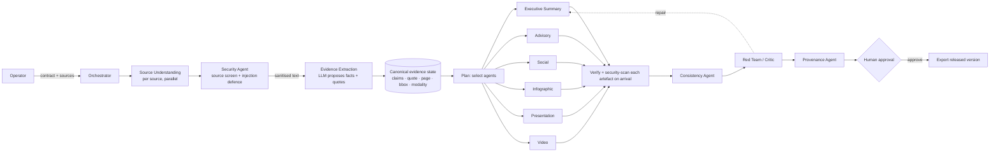

# PRAMAAN · Architecture

## Principle

Existing generators optimise generation; PRAMAAN optimises **trustworthy transformation**:

```
SOURCE → EVIDENCE → TRANSFORMATION → VERIFICATION → APPROVAL → PROVENANCE
```

## Flow



Plan → Act → Observe → Critique → Repair → Verify → Decide. Every step is a task in one server-side
state object; the workspace, task panel and artefact views render the same tasks, so statuses never disagree.

## Trust boundaries

| Channel | Treatment |
|---|---|
| System instructions | Fixed in `app/prompts.py` |
| User intent | Transformation contract (audience, tone, language, detail, objective, style, classification, truth and security constraints), hashed into provenance |
| Evidence ledger | The only permitted source of facts for writers |
| Source content | Untrusted data between delimiters; embedded instructions removed, credentials withheld |

## Evidence state

`claim_id · claim · label · entity · attribute · value · normalized · modality · source · page · char_span · bbox · evidence_text · status · version · history`

Status is earned: verbatim quote containing the value → `verified`; value present but quote re-anchored → `needs_review`;
not found → `unsupported`; disagreeing sources → `conflict` (never resolved automatically).

## Verification (deterministic)

* Dates and numbers are normalised and compared with the claim each sentence is about (keyword affinity), so a changed date is
  caught even if that date appears elsewhere in the source.
* Uncertainty scale: unverified < possible/suspected/alleged < reported/estimated < probable < confirmed. Output stronger than source → violation.
* Consistency: the value each artefact states per claim is compared across artefacts.
* Red team verdict per artefact: factual drift, unsupported claims, cross-output conflicts, security leaks, uncertainty violations.

## Security policy

Exposure = f(artefact type, audience, classification) → public / leadership / technical. Each finding class maps to
ALLOW, MASK, REDACT, RESTRICT, REVIEW or BLOCK. The released version applies the policy; export always uses it.

## Provenance

Append-only JSONL ledger; each entry = {kind, transformation, payload hashes, prev_hash, entry_hash}. Entries:
transformation_state, evidence_update, source_conflict_resolved, approval, export. Chain validity is checked on read.
Only hashes and metadata are stored — never source content.

## Model routing

Capabilities (text reasoning, translation, multimodal, speech, parsing) map to ordered model lists behind one gateway
(Hugging Face Inference Providers, or `MODEL_GATEWAY_URL` for a self-hosted OpenAI-compatible server). Models are
configuration, not code.

## Scaling path

State is one JSON document per transformation (`data/transformations/TR-*/`). Moving it to PostgreSQL, tasks to a queue
(Redis/Celery or a LangGraph runtime) and adding a vector store for retrieval does not change the API or the UI contract.
